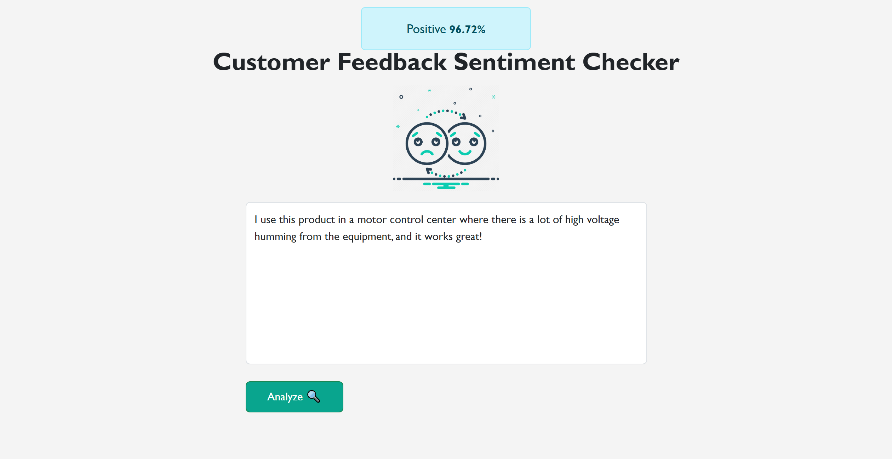

# Customer Feedback Sentiment Analysis (ML + Flask) 🧠

A simple yet powerful sentiment analysis system that predicts whether customer feedback is **Positive** or **Negative** with a **confidence percentage** using **Python, Scikit-learn, and Flask**.



## ⚙️ How to Run Locally

### 1. Clone the repo
```bash
git clone https://github.com/apdoolhamza/customer-feedback-sentiment-checker.git
```
### 2. Create a virtual environment
```bash
python -m venv venv
source venv/bin/activate  # On Windows: venv\Scripts\activate
```
### 3. Install dependencies
```bash
pip install -r requirements.txt
```
### 4. Run the project
```bash
python app.py
```

## Dataset
This project uses a simplified version of the Amazon Cell Phones Reviews Dataset.

## 🛠 Technologies Used
* Python
* Scikit-learn
* Flask
* NLTK (offline)
* Bootstrap 5
* HTML5

## Possible Improvements
* REST API version (/api/sentiment)
* Save feedback + prediction in DB
* Admin dashboard with Chart.js
* Multi-class support (neutral, mixed)
* HuggingFace/BERT upgrade
* Deploy on Railway, Render, or Heroku

## Author
Built with ❤️ by [@apdoolhamza](https://github.com/apdoolhamza/)

##  License
This project is open source under the [MIT License](https://github.com/apdoolhamza/customer-feedback-sentiment-checker/blob/main/LICENSE)
